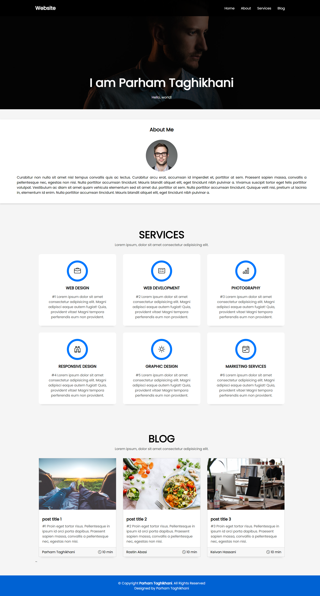

<p align="left">

🌐 **زبان:** فارسی [🇺🇸 English](./README.md) | 🇮🇷

</p>

---

# 🌐 وب‌سایت شخصی (Portfolio)

یک وب‌سایت شخصی مدرن و واکنش‌گرا که با **React** و **Vite** توسعه داده شده است. این پروژه با معماری کامپوننت‌محور پیاده‌سازی شده و محیطی ساده، زیبا و قابل توسعه برای معرفی شخص، خدمات و مقالات فراهم می‌کند.

---

## ✨ ویژگی‌ها

- طراحی کاملاً واکنش‌گرا (Responsive)
- رابط کاربری مدرن و مینیمال
- معماری مبتنی بر کامپوننت
- بخش معرفی (About)
- بخش خدمات (Services)
- بخش وبلاگ (Blog)
- ناوبری روان بین بخش‌های مختلف
- قابلیت شخصی‌سازی و توسعه آسان

---

## 🛠️ تکنولوژی‌های استفاده‌شده

- React 19
- Vite
- JavaScript (ES6+)
- CSS3
- HTML5

---

## 📂 ساختار پروژه

```text
src/
├── components/
│   ├── about/
│   ├── blog/
│   ├── footer/
│   ├── header/
│   └── services/
├── App.jsx
├── main.jsx
└── main.css

asset/
├── fonts/
└── img/

Screenshots/
└── Home.png
```

---

## 🚀 نحوه اجرا

ابتدا پروژه را Clone کنید:

```bash
git clone https://github.com/Parham-Codes/REPOSITORY_NAME.git
```

وارد پوشه پروژه شوید:

```bash
cd REPOSITORY_NAME
```

وابستگی‌ها را نصب کنید:

```bash
npm install
```

سرور توسعه را اجرا کنید:

```bash
npm run dev
```

برای ساخت نسخه Production:

```bash
npm run build
```

برای مشاهده نسخه Production:

```bash
npm run preview
```

---

## 🎯 اهداف این پروژه

این پروژه با هدف تمرین و تقویت مهارت‌های زیر توسعه داده شده است:

- ساخت کامپوننت‌های React
- استفاده از معماری Component-Based
- مدیریت Props
- ساختاردهی استاندارد پروژه
- طراحی واکنش‌گرا (Responsive Design)
- توسعه رابط کاربری تمیز و مدرن

---

## 📷 اسکرین‌شات

| صفحه اصلی                   |
| --------------------------- |
|  |

---

# 👨‍💻 توسعه‌دهنده

**پرهام تقی‌خانی**

GitHub: https://github.com/Parham-Codes
Email: parhamtaghikhani.31@gmail.com

---

<div align="center">

### ⭐ اگر از این پروژه خوشتان آمد، با دادن یک Star از آن حمایت کنید.

</div>
